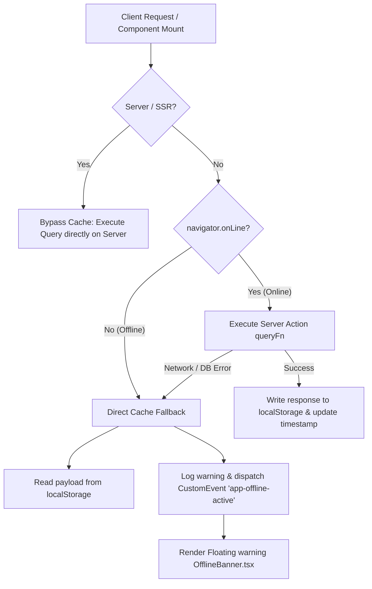
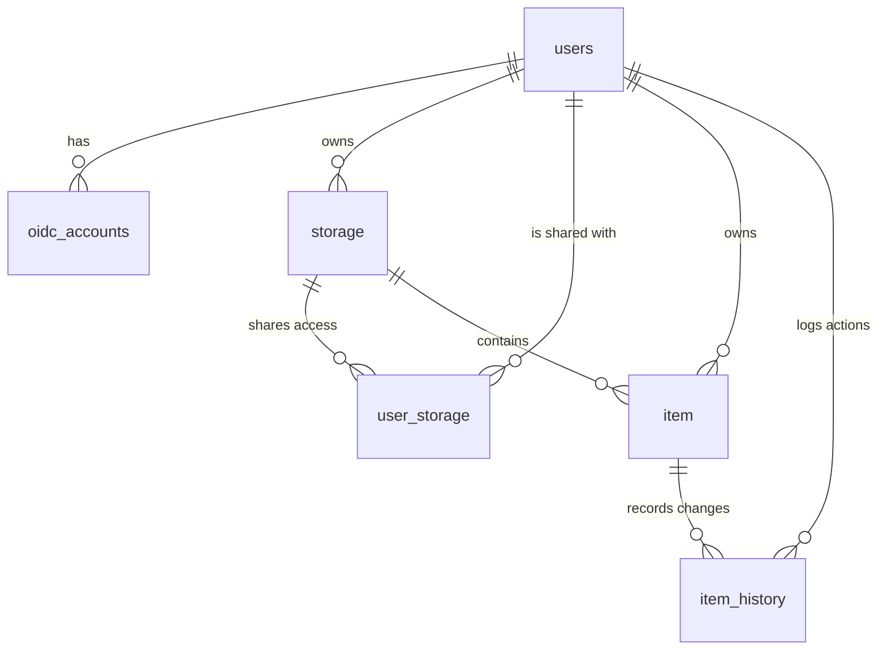
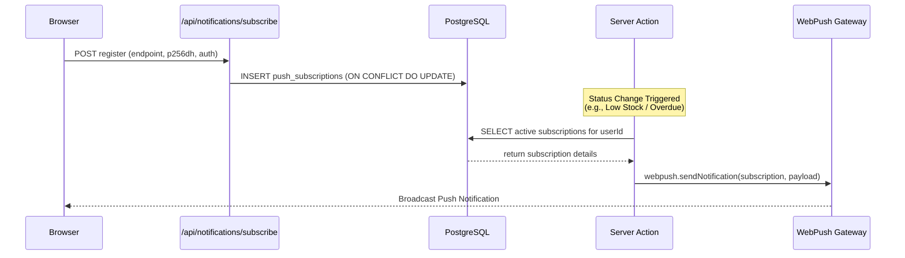

# 🏗️ Warehouse PWA — Deep System Architecture & Security Manual

Welcome to the **Warehouse Inventory Management** deep-dive architectural and security guide. This document is written with maximum technical depth, providing exact SQL schemas, custom caching mechanics, RBAC models, Edge proxy rules, S3 streaming configurations, and push notification architectures. It serves as a comprehensive reference guide for developers and AI agent assistants.

---

## 🔌 1. Offline Synchronization & PWA Engine

The application achieves instant responsiveness and offline capability through a sophisticated dual-layer caching model.



### ⚡ Caching Layer (`withOfflineCache`)
The custom helper function `withOfflineCache` located in [offlineCache.ts](file:///E:/archiwum/My%20Creations/WebApps/warehouse/src/lib/offlineCache.ts) is responsible for intercepting all client-side network queries:

```typescript
export async function withOfflineCache<T>(
  cacheKey: string,
  queryFn: () => Promise<T>,
  fallbackValue: T
): Promise<T> {
  if (typeof window === 'undefined') return queryFn(); // Server Side Rendering (SSR) bypass

  // Bypasses network entirely if the browser is offline. Instantly served in < 1ms
  if (!navigator.onLine) {
    window.dispatchEvent(new CustomEvent('app-offline-active', { detail: { key: cacheKey } }));
    const cached = localStorage.getItem(`offline_cache:${cacheKey}`);
    return cached ? (JSON.parse(cached) as T) : fallbackValue;
  }

  try {
    const data = await queryFn();
    if (data !== undefined && data !== null && (typeof data !== 'boolean' || data === true)) {
      localStorage.setItem(`offline_cache:${cacheKey}`, JSON.stringify(data));
      localStorage.setItem(`offline_cache_time:${cacheKey}`, new Date().toISOString());
      registerCacheKey(cacheKey);
    }
    return data;
  } catch (error) {
    window.dispatchEvent(new CustomEvent('app-offline-active', { detail: { key: cacheKey } }));
    const cached = localStorage.getItem(`offline_cache:${cacheKey}`);
    return cached ? (JSON.parse(cached) as T) : fallbackValue;
  }
}
```

### 🛜 Network Fallback Page Routing
Under the hood, `@ducanh2912/next-pwa` registers a custom service worker (`public/sw.js`). When a page navigation fails completely while offline, the service worker intercepts the request and serves `/offline` (defined in [src/app/offline/page.tsx](file:///E:/archiwum/My%20Creations/WebApps/warehouse/src/app/offline/page.tsx)). 

This view gathers all available keys registered in `localStorage` starting with `storage_items:` or `item_info:` and compiles them into a **single, flat-search client index**. The user can search and filter the offline local catalog with zero latency.

---

## 🗄️ 2. Database Schema Deep-Dive

The database runs PostgreSQL 15. The schema is defined in [init.sql](file:///E:/archiwum/My%20Creations/WebApps/warehouse/init.sql). Below is the comprehensive table relationship layout:



### 📊 SQL Table Definitions & Constraints

#### 1. `users`
Represents application accounts registered via OAuth.
- `id` (UUID): Primary key, defaults to `gen_random_uuid()`.
- `display_name` (VARCHAR 255): Full name.
- `email` (VARCHAR 320): Unique, validated email constraint.
- `avatar_url` (TEXT): Google profile image pointer.

#### 2. `oidc_accounts`
Maps Google OpenID Connect identifiers to internal users.
- `user_id` (UUID): Foreign key linking to `users(id)`, cascade deletes.
- `provider` (VARCHAR 50) + `oidc_sub` (TEXT): Unique composite index. Ensures OIDC accounts map uniquely to a single user.

#### 3. `storage`
Represents physical or logical warehouse storage spaces.
- `id` (UUID): Primary key.
- `owner_id` (UUID): Foreign key linking to the `users(id)` of the creator.
- `localization` (TEXT): Stores stringified coordinate data or descriptions.
- `storage_area` (INT): Dimensions in square meters.

#### 4. `item`
Represents assets or inventory units stored within spaces.
- `storage_id` (UUID): Foreign key linking to `storage(id)`. Cascades deletes if the warehouse is removed.
- `owner_id` (UUID): Foreign key linking to the creator.
- `amount` (REAL) + `min_amount` (REAL): Float-based inventory numbers.
- `data` (JSON): Stores unstructured custom attributes defined by item templates.
- `last_borrowed_to` (UUID): Foreign key pointing to `users(id)` of the borrower.

#### 5. `user_storage`
Handles warehouse sharing and role-based access control (RBAC).
- `user_id` (UUID): Links to `users(id)`, cascade deletes.
- `storage_id` (UUID): Links to `storage(id)`, cascade deletes.
- `role` (VARCHAR 20): Roles include `'admin'` (read, write, modify storage) and `'viewer'` (read-only).
- Composite Primary Key: `(user_id, storage_id)` prevents redundant rows.

---

## 🔑 3. Role-Based Access Control (RBAC) Matrix

Access controls are rigorously validated at the database query layer.

| Operation | Required Role / Context | Implementation Location |
| :--- | :--- | :--- |
| **Create Storage** | Authenticated User | `createStorageQuery` |
| **Edit Storage Info** | Storage Owner | `editStorageQuery` |
| **Delete Storage** | Storage Owner (Cascades Items) | `deleteStorageQuery` |
| **Add / Edit / Delete Item** | Storage Owner OR User with `'admin'` role | `createItemQuery`, `editItemQuery`, `deleteItemQuery` |
| **Duplicate Item** | Storage Owner OR User with `'admin'` role | `duplicateItemQuery` |
| **Borrow / Return Item** | Storage Owner OR Member in `user_storage` | `borrowItemQuery`, `returnItemQuery` |
| **Template Operations** | Template Owner | `createTemplateQuery`, `getTemplateQuery` |

---

## 🔒 4. Edge Middleware & Security Implementations

Security is implemented globally across network boundaries, routing files, and S3 APIs.

### 🌐 Next.js 16 Routing Proxy (`src/proxy.ts`)
Next.js 16 routing protection is managed in [src/proxy.ts](file:///E:/archiwum/My%20Creations/WebApps/warehouse/src/proxy.ts).
```typescript
export { auth as proxy } from "@/lib/auth";

export const config = {
  matcher: [
    // Blocks unauthenticated access to all pages except login, installation, and public assets
    "/((?!api/auth|login|install|offline|_next/static|_next/image|favicon.ico|icons|manifest.json|sw.js).*)",
  ],
};
```
If an unauthenticated user attempts to access `/locations`, the Next.js Edge proxy automatically halts execution and redirects the request to `/login`.

### 🖼️ Private S3 Image Proxy (`src/app/api/images/[key]/route.ts`)
The MinIO/S3 bucket has no public access (set to `private` in `create-buckets.sh`). The Next.js server acts as an authorized gateway, validating permissions before reading binary data:

```typescript
export async function GET(req: Request, { params }: { params: Promise<{ key: string }> }) {
  const session = await auth();
  const userId = session?.user?.id;
  if (!userId) return new NextResponse("Unauthorized", { status: 401 });

  const { key } = await params;

  try {
    // 1. RBAC check for item images
    const itemAccess = await db`
      SELECT 1 FROM item i
      WHERE i.image_url LIKE '%' || ${key}
      AND (
        i.owner_id = ${userId}
        OR i.storage_id IN (
          SELECT id FROM storage WHERE owner_id = ${userId}
          UNION
          SELECT storage_id FROM user_storage WHERE user_id = ${userId}
        )
      );
    `;

    // 2. RBAC check for storage banner images
    const storageAccess = await db`
      SELECT 1 FROM storage s
      LEFT JOIN user_storage us ON s.id = us.storage_id AND us.user_id = ${userId}
      WHERE s.img_url LIKE '%' || ${key}
      AND (s.owner_id = ${userId} OR us.user_id IS NOT NULL);
    `;

    if (itemAccess.length === 0 && storageAccess.length === 0) {
      return new NextResponse("Forbidden", { status: 403 });
    }

    const command = new GetObjectCommand({ Bucket: process.env.S3_BUCKET_NAME!, Key: key });
    const s3Response = await s3.send(command);

    if (!s3Response.Body) return new NextResponse("Not Found", { status: 404 });

    const contentType = s3Response.ContentType || "application/octet-stream";
    const responseHeaders = new Headers();
    responseHeaders.set("Content-Type", contentType);
    responseHeaders.set("Cache-Control", "private, max-age=3600"); // Secure browser caching

    return new NextResponse(s3Response.Body.transformToWebStream(), { headers: responseHeaders });
  } catch (error) {
    return new NextResponse("Internal Server Error", { status: 500 });
  }
}
```

### 🔒 Fixed BOLA / IDOR Query Snippets
Below are the audited, secured SQL queries implemented in [queries.ts](file:///E:/archiwum/My%20Creations/WebApps/warehouse/src/lib/actions/queries.ts):

#### `duplicateItemQuery`
Prevents unauthorized replication of other users' inventory items.
```typescript
export async function duplicateItemQuery(user_id: string, item_id: string) {
    if (user_id == "") return false;
    const result = await db`
        INSERT INTO item (name, amount, storage_id, unit_of_measurement, data, owner_id, image_url) 
        SELECT name || ' (Copy)', amount, storage_id, unit_of_measurement, data, ${user_id}, image_url 
        FROM item 
        WHERE id = ${item_id} 
        AND storage_id IN (
            SELECT id FROM storage WHERE owner_id = ${user_id}
            UNION
            SELECT storage_id FROM user_storage WHERE user_id = ${user_id} AND role = 'admin'
        )
        RETURNING id, storage_id; 
    `;
    // Revalidation logic...
    return result;
}
```

#### `borrowItemQuery`
Requires the user to have read access to the space containing the item before borrowing.
```typescript
export async function borrowItemQuery(item_id: string, user_id: string, borrowed_to_id: string, notes: string) {
    if (user_id == "") return false;
    return await db.begin(async sql => {
        const itemCheck = await sql`
            SELECT i.storage_id FROM item i
            WHERE i.id = ${item_id}
            AND (
                i.owner_id = ${user_id}
                OR i.storage_id IN (
                    SELECT id FROM storage WHERE owner_id = ${user_id}
                    UNION
                    SELECT storage_id FROM user_storage WHERE user_id = ${user_id}
                )
            );
        `;
        if (itemCheck.length === 0) return false;
        const storage_id = itemCheck[0].storage_id;

        await sql`UPDATE item SET is_borrowed = true, last_borrowed_to = ${borrowed_to_id} WHERE id = ${item_id}`;
        await sql`INSERT INTO item_history (item_id, user_id, action_type, notes) VALUES (${item_id}, ${user_id}, 'borrow', ${notes})`;
        // Revalidation...
        return true;
    });
}
```

---

## 🔔 5. Web Push Notification Flow

Web push notifications are fully configured via standard VAPID key pairs.



- **Subscription Housekeeping**: If a subscription fails with status `410` (Gone) or `404` (Not Found) during push delivery, [notifications.ts](file:///E:/archiwum/My%20Creations/WebApps/warehouse/src/lib/notifications.ts) automatically deletes the expired endpoint from the database to keep tables clean.
- **Stock Threshold Checks**: Upon editing an item, `checkAndTriggerItemMaintenanceNotification` checks if `amount <= min_amount` and broadcasts warnings to all warehouse administrators.
